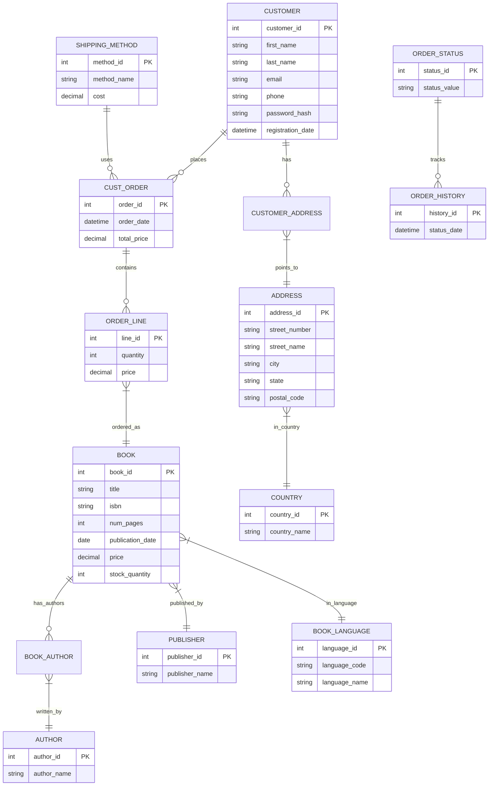

# BookStore Database Management System

## Project Overview
A comprehensive MySQL database solution for bookstore operations management, designed to handle:
- Inventory tracking (15,000+ book titles)
- Customer relationships (100,000+ customer records)
- Order processing (500+ daily transactions)
- Shipping logistics

## Database Specifications
**Version**: 1.0  
**Normalization**: 3NF compliant  
**Tables**: 15  
**Relationships**: 22  
**Security**: Role-based access control

# BookStore Database - Entity Relationship Diagram

## Diagram Notes
- **PK** = Primary Key
- Solid lines indicate one-to-many relationships
- Diamonds represent many-to-many relationships
- Color-coded by system component (orders, inventory, customers)
